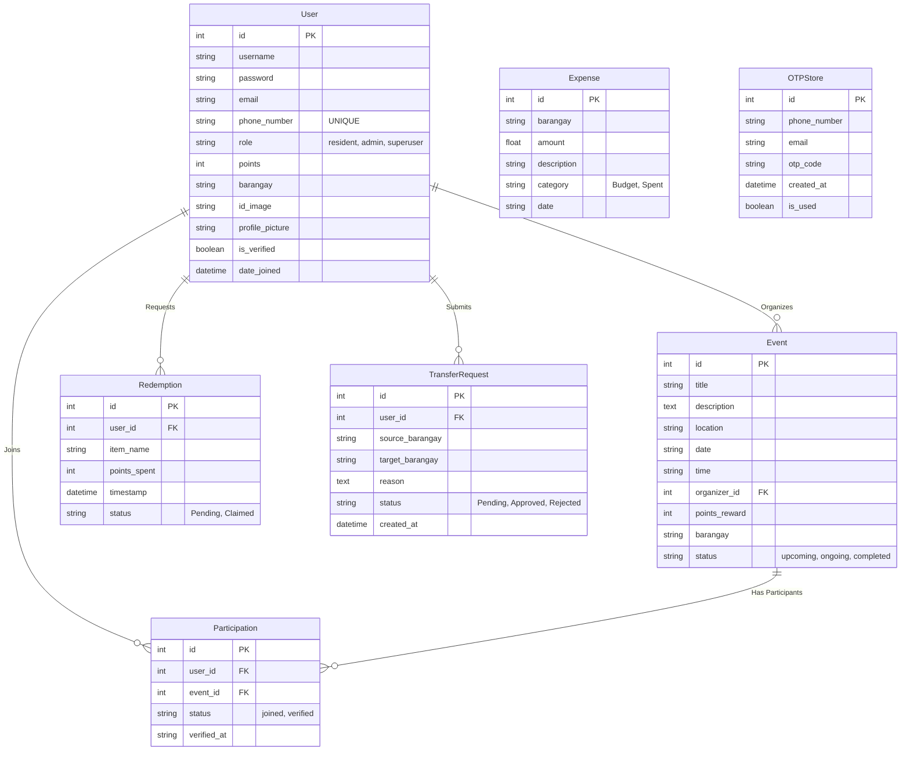

# EcoConnect Entity Relationship Diagram (ERD)

This is a Mermaid diagram. If you are using VSCode, you can view this directly by installing the "Mermaid Preview" extension, or by opening this file on GitHub.

